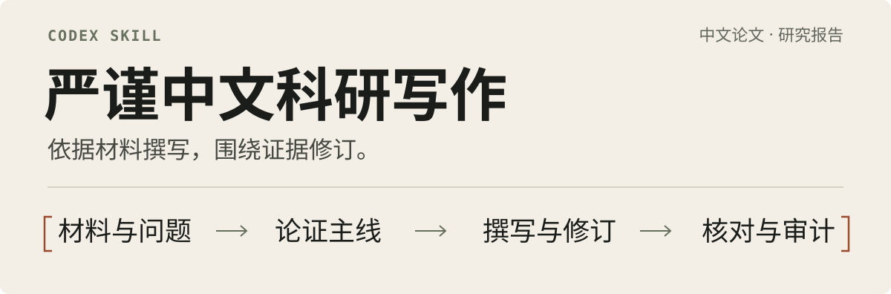

<p align="center">
  
</p>

面向中文科学论文、学位论文、研究报告和技术报告的 Codex Skill。依据材料组织论证、撰写初稿、修订正文并审计终稿，保持主张与证据一致。

## 从材料到正文

**材料**

> 某调查的编码规则v2 将 99 定义为缺失值。数据按 v2 采集，共 120 份记录，其中 8 份主要变量取值为 99，已按缺失规则排除。

**方法段初稿**

> 数据按某调查的编码规则v2 采集，依据该版本将取值 99 视为缺失值。120 份记录中，8 份因主要变量取值为 99 而排除，最终纳入 112 份。

保留材料来源、变量定义、处理规则和样本数量，将核验结果组织为论文表述。

## 五种任务模式

| 模式 | 处理内容 |
| --- | --- |
| 初稿撰写 | 根据材料、分析和提纲，撰写片段、章节或全文。 |
| 局部润色 | 调整词句、指代和衔接，保持原有含义。 |
| 深度修订 | 调整论证、章节接口及方法与结果的对应关系。 |
| 反馈整合 | 处理选定意见，核对实际受影响的内容。 |
| 终稿审计 | 定位问题、说明依据，不直接改写正文。 |

## 工作流程

**材料与范围 → 论证主线 → 撰写或修订 → 证据与语言验收 → 按需审计**

- **明确依据**：初稿依据研究材料与已完成分析；修订以用户当前稿为基线。
- **组织论证**：按段落功能安排定义、方法、结果和解释，修正超出证据的主张，处理重复限定与工作痕迹。
- **完成验收**：核对事实、引用、方法与结果、图表和表达；审计报告按任务要求提供。

可从任一模式进入，检查限于指定范围及真实依赖。局部润色不启动全文流程，初稿任务不额外交付审计报告。

## 安装与使用

将技能安装到个人技能目录：

```bash
git clone https://github.com/Jill-Stingray-L/rigorous-academic-writing-zh.git \
  "$HOME/.agents/skills/rigorous-academic-writing-zh"
```

**撰写初稿**：提供材料、提纲和目标要求，指定写作范围。

```text
$rigorous-academic-writing-zh
请依据所附研究材料和提纲撰写方法章初稿。
按学校规范组织正文。
区分已完成分析与研究计划。
交付前核对证据和表达，只返回正文。
```

**审计终稿**：提供当前稿，说明审计范围和交付形式。

```text
$rigorous-academic-writing-zh
请审计这份论文的事实与引用、
方法—结果关系及结论范围。
列出具体问题和依据，不改写正文。
```

## 使用边界

- 数据、文献、结论和实施成效须有依据；材料不足时说明缺口或调整主张。
- 保留必要限制及相关不利结果，不用增强语气或选择性报告替代论证。
- 外部核验与材料发送遵循用户授权；未发表及受限材料默认留在本地。
- 语言与统计指标用于定位问题，不用于作者身份判断或检测通过承诺。

## 辅助审计

可选脚本支持 UTF-8 Markdown 和纯文本，仅依赖 Python 3 标准库：

```bash
python scripts/audit_academic_zh.py manuscript.md
python scripts/audit_academic_zh.py manuscript.md --format json
```

脚本定位编辑残留、术语变体、图表编号、重复结构等线索，供语义复核；不自动改写正文。

## 规则与维护

- [技能入口](./SKILL.md)：工作范围、执行流程与交付验收。
- [参考规范](./references/)：证据、论文与报告结构、中文表达及反馈处理。
- [设计来源](./references/provenance.md)：规则来源与整合取舍。
- [行为样例](./tests/behavior_cases.md)：用于检查实际写作与审计行为。

[MIT License](./LICENSE)
